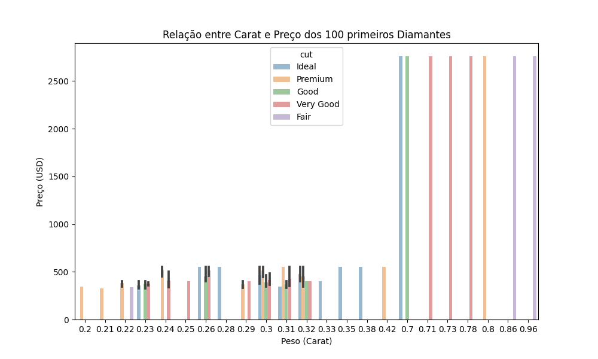

# Análise e predição de diamantes

    

    

Este projeto visa explorar e analisar o conjunto de dados de diamantes, onde contém informações sobre aproximadamente 54.000 diamantes, com variáveis que descrevem características como peso, corte, cor e preço. O objetivo é utilizar tecnicas de análise de dados e visualização para entender de forma mais clara como essas características afetam o preço dos diamantes.

**Este gráfico mostra a relação entre o peso (carat) e o preço dos diamantes:**

# Justificativa

A análise de dados de diamantes é relevante tanto para consumidores quanto para profissionais da indústria de joias. Compreender como peso, corte, cor e clareza influenciam no preço pode ajudar consumidores a fazer melhores escolhas. Para proffisonais da indústria, insight obtidos a partir dessa análise podem informar estratégias de marketing e precificação.

# Metodologia
O projeto será desenvolvido utilizando a metodologia CRISP-DM, seguindo os seguintes passos:

- Entendimento de negócio
- Entendimento de dados
- Preparação dos dados
- Modelagem

# Resultados Esperados
Espera-se identificar as váriaveis que afetam o preço dos diamantes e prever, de forma precisa, o valor de novos diamantes, fornecendo informações úteis para consumidores e profissionais da indústria.
